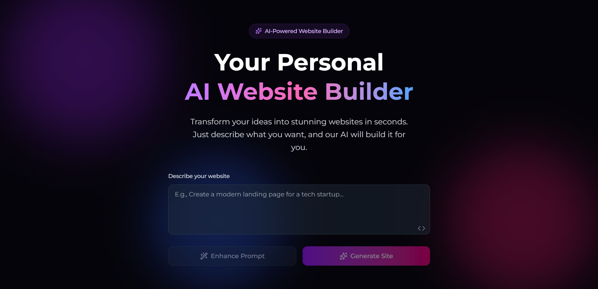

# AI Website Builder

A full-stack MERN application that allows users to build and design websites using the power of generative AI. This tool provides AI-assisted content generation, design suggestions, and a simple, intuitive interface to create modern websites from scratch.





---

## Features

-   **AI-Powered Content:** Generate headlines, text, and other content based on user prompts.
-   **AI Design Assistance:** Get suggestions for layouts and color palettes.
-   **Template-Based Creation:** Start quickly with a variety of pre-built website templates (Portfolio, Blog, E-commerce).
-   **Live Preview:** See real-time changes to your website as you build it.
-   **Secure Authentication:** User registration and login system to manage projects.
-   **RESTful API:** A clean, well-structured backend API to handle all application logic.

---

## Tech Stack

This project is built using the MERN stack and other modern web technologies.

**Frontend:**
-   **React 18:** A JavaScript library for building user interfaces.
-   **Vite:** A next-generation frontend tooling for fast development.
-   **Tailwind CSS:** A utility-first CSS framework for rapid UI development.
-   **React Router:** For client-side routing in a Single-Page Application (SPA).

**Backend:**
-   **Node.js:** A JavaScript runtime environment.
-   **Express.js:** A minimal and flexible Node.js web application framework.
-   **MongoDB:** A NoSQL database for storing user and website data.
-   **Mongoose:** An ODM (Object Data Modeling) library for MongoDB and Node.js.
-   **JWT (JSON Web Tokens):** For secure user authentication.
-   **CORS:** For handling cross-origin requests between the frontend and backend.

---

## Getting Started

Follow these instructions to get a local copy of the project up and running for development and testing purposes.

### Prerequisites

-   Node.js (v18 or later)
-   npm
-   MongoDB (local instance or a cloud-based service like MongoDB Atlas)

### Installation & Setup

1.  **Clone the repository:**
    ```sh
    git clone [https://github.com/your-username/AI-website-builder.git](https://github.com/your-username/AI-website-builder.git)
    cd AI-website-builder
    ```

2.  **Setup the Backend:**
    -   Navigate to the backend directory:
        ```sh
        cd backend
        ```
    -   Install backend dependencies:
        ```sh
        npm install
        ```
    -   Create a `.env` file in the `backend` directory and add your environment variables:
        ```env
        PORT=5001
        MONGO_URI=your_mongodb_connection_string
        JWT_SECRET=your_jwt_secret_key
        ```
    -   Start the backend server:
        ```sh
        npm start
        ```
    -   The server should now be running on `http://localhost:5001`.

3.  **Setup the Frontend:**
    -   Open a **new terminal window** and navigate to the frontend directory:
        ```sh
        cd ai-website-builder
        ```
    -   Install frontend dependencies:
        ```sh
        npm install
        ```
    -   Start the frontend development server:
        ```sh
        npm run dev
        ```
    -   The application should now be running and accessible at `http://localhost:5173` (or another port specified by Vite).
